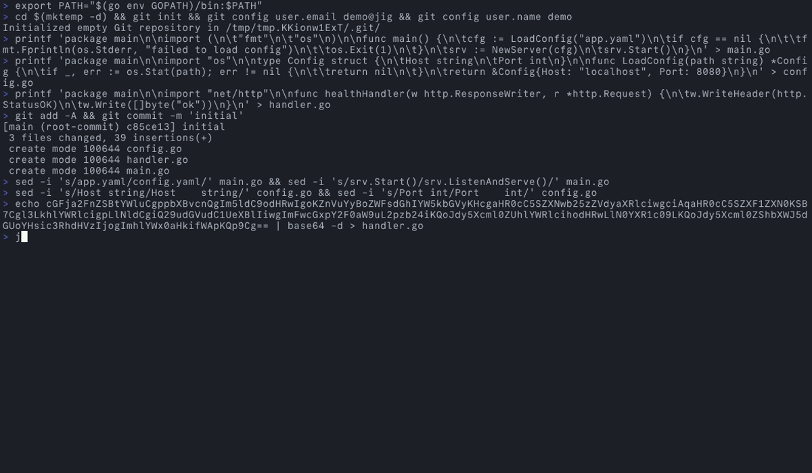
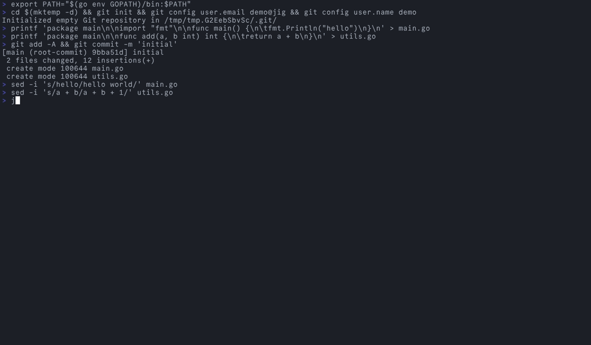
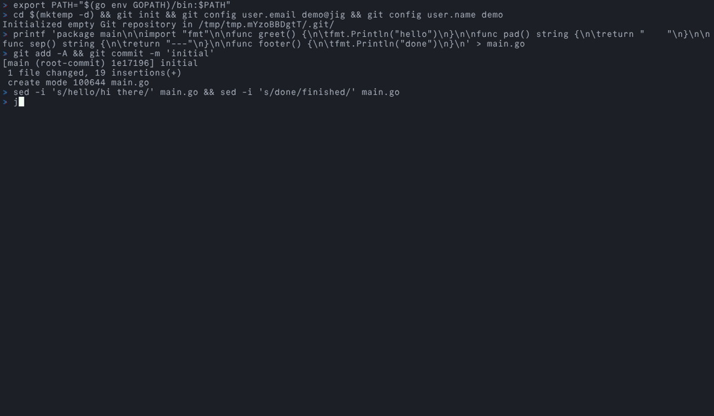
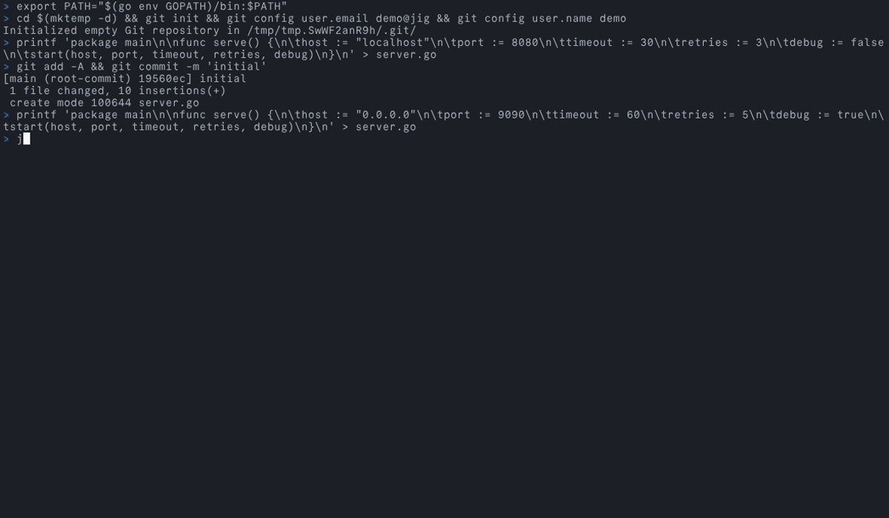
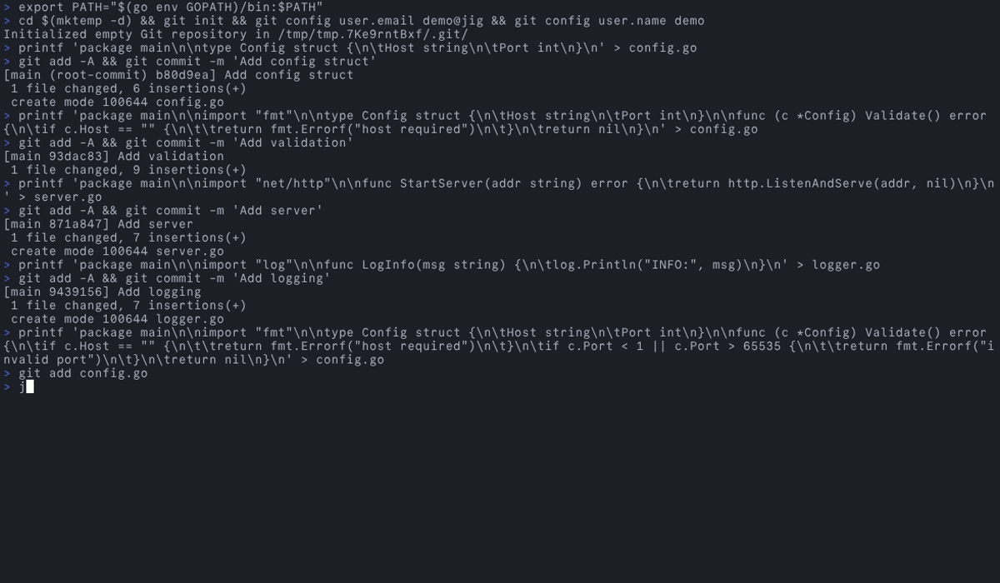
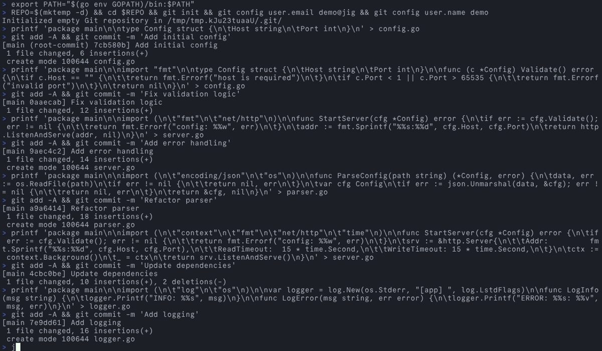
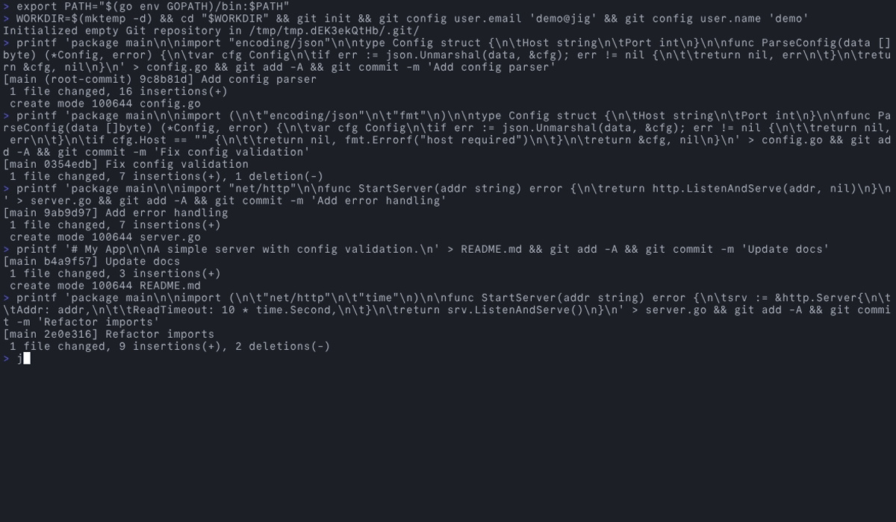
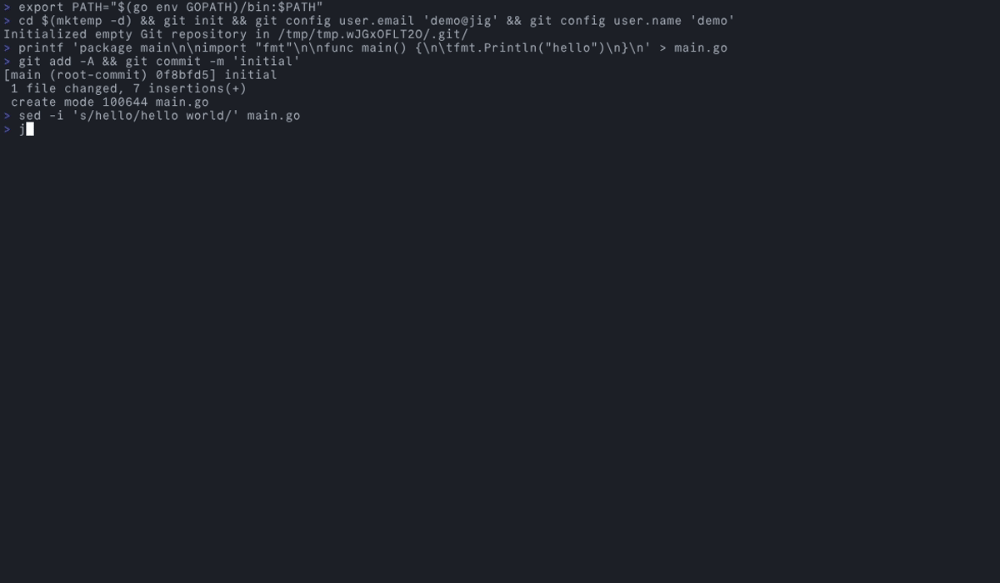
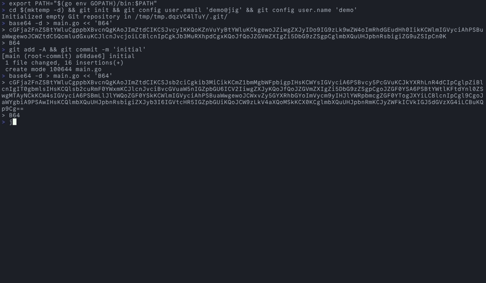
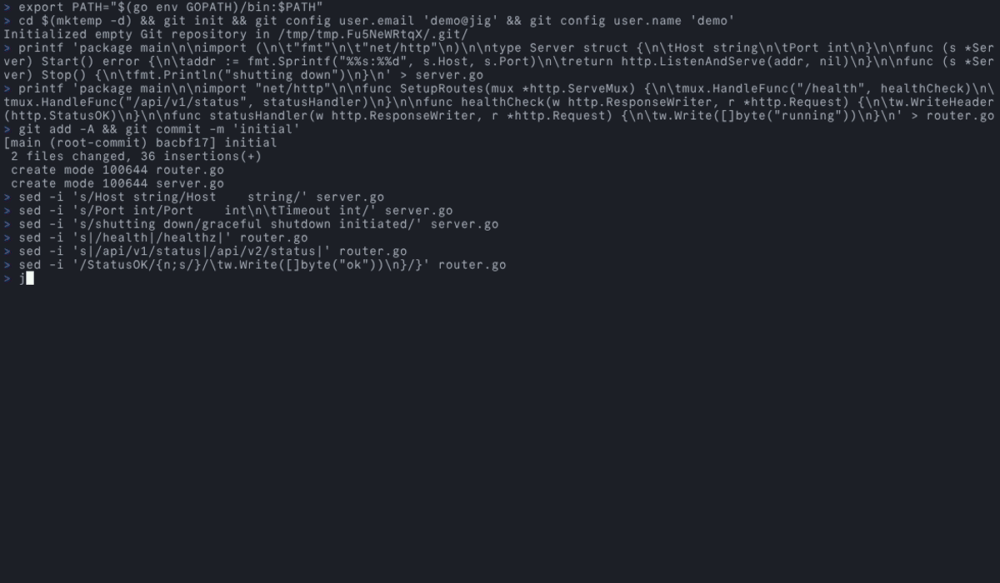

# jig

An interactive TUI for git workflows, built with [Bubble Tea](https://github.com/charmbracelet/bubbletea). One tool replacing the features I use most from [forgit](https://github.com/wfxr/forgit), [diffnav](https://github.com/dlvhdr/diffnav), [tig](https://github.com/jonas/tig), and [git-interactive-rebase-tool](https://github.com/MitMaro/git-interactive-rebase-tool).



## Commands

### jig add - Stage files interactively



Select modified files and stage them in one shot. Replaces `forgit add`.

| Key | Action |
|-----|--------|
| `Space` | Toggle file checked/unchecked |
| `Enter` | Stage checked files |
| `a` / `d` | Check all / uncheck all |
| `c` / `C` | Commit / commit (title only) |
| `e` | Edit selected diff in `$EDITOR` |

Flags: `--interactive`, `-i` - open TUI even when paths are given (default: stages paths directly).

### jig hunk-add - Stage individual hunks



Stage specific hunks instead of whole files. Press Enter to switch to line-edit mode for surgical staging.



| Key | Action |
|-----|--------|
| `Space` | Toggle hunk staged/unstaged |
| `Enter` | Enter line-edit mode |
| `w` | Apply staged hunks |
| `s` | Split current hunk into smaller hunks |
| `c` / `C` | Commit / commit (title only) |
| `e` | Edit selected diff in `$EDITOR` |

### jig checkout - Discard file changes interactively

Select modified files and discard their changes. Same selection pattern as add/reset.

| Key | Action |
|-----|--------|
| `Space` | Toggle file checked/unchecked |
| `Enter` | Discard checked files |
| `a` / `d` | Check all / uncheck all |

Flags: `--direct`, `-d` - discard files directly without opening TUI.

### jig diff - Interactive diff viewer

Browse diffs across files with syntax-highlighted side-by-side view. Replaces `diffnav`.

| Key | Action |
|-----|--------|
| `j` / `k` | Navigate files |
| `{` / `}` | Decrease / increase context lines |
| `e` | Edit selected diff in `$EDITOR` |

Flags: `--staged` - show staged changes instead of working tree changes.

### jig fixup - Create fixup commits interactively



Pick a target commit and create a fixup commit that autosquashes into it. Replaces `forgit fixup`.

| Key | Action |
|-----|--------|
| `j` / `k` | Navigate commits |
| `Enter` | Create fixup commit targeting selected commit |

### jig hunk-checkout - Discard individual hunks

Mirrors hunk-add but discards hunks from working tree. Prompts for confirmation before applying.

| Key | Action |
|-----|--------|
| `Space` | Toggle hunk staged/unstaged |
| `j` / `k` | Navigate hunks |
| `Enter` | Apply (discard) selected hunks |

### jig hunk-reset - Unstage individual hunks

Mirrors hunk-add but unstages hunks from the index.

| Key | Action |
|-----|--------|
| `Space` | Toggle hunk staged/unstaged |
| `j` / `k` | Navigate hunks |
| `Enter` | Apply (unstage) selected hunks |

### jig log - Interactive commit log browser



Browse commit history with inline diff preview per commit. Replaces `tig` / `git log`.

| Key | Action |
|-----|--------|
| `j` / `k` | Navigate commits |
| `{` / `}` | Decrease / increase context lines |

### jig rebase-interactive - Interactive rebase todo editor



Edit the rebase todo list with single-key actions and drag reordering. Replaces `git-interactive-rebase-tool`.

| Key | Action |
|-----|--------|
| `p` / `r` / `e` / `s` / `f` / `d` | Set action to pick / reword / edit / squash / fixup / drop |
| `Space` | Cycle through rebase actions |
| `J` / `K` | Move commit down / up in the todo list |
| `w` / `Enter` | Confirm and write the rebase todo |
| `q` / `Esc` | Abort rebase |

### jig reset - Unstage files interactively

Mirrors add but unstages files from the index. Replaces `forgit reset`.

| Key | Action |
|-----|--------|
| `Space` | Toggle file checked/unchecked |
| `Enter` | Unstage checked files |
| `a` / `d` | Check all / uncheck all |
| `e` | Edit selected diff in `$EDITOR` |

Flags: `--interactive`, `-i` - open TUI even when paths are given (default: unstages paths directly).

## Features

### Help overlay



Press `?` to open the keybinding reference, composited over the current view. Dismiss with `q` or `Esc`.

### Search



Press `/` to search in the diff panel. Use `n` / `N` to cycle through matches.

### Maximize



Press `F` to toggle full-width diff view. File navigation (`j`/`k`) still works in maximize mode.

## Universal keys

Available in all two-panel commands.

| Key | Action |
|-----|--------|
| `?` | Toggle help overlay |
| `Tab` | Switch focus between file list and diff panel |
| `D` | Toggle diff panel visibility |
| `F` | Toggle maximize diff panel (full-width) |
| `q` / `Esc` | Quit command (Esc also clears active search) |
| `w` | Toggle soft-wrap in diff panel (when diff is focused) |
| `[` / `]` | Shrink / grow file list panel by 5% (persisted to config) |
| `/` | Search in diff (when diff is focused) |
| `n` / `N` | Next / previous search match |
| `{` / `}` | Decrease / increase diff context lines |

## Pager Mode

`jig diff` can act as a git pager, displaying piped diff output in the interactive TUI instead of running its own `git diff` internally. When stdin is a pipe (not a terminal), jig reads the diff from stdin and opens `/dev/tty` for keyboard input.

### Setup

```sh
git config --global pager.diff "jig diff"
```

With this, running `git diff` or `git diff --cached` pipes the output through jig automatically. Any flags git passes to the diff are preserved in the piped content - jig renders exactly what git produces.

### How it works

1. jig detects that stdin is a pipe (not a character device)
2. Reads the full diff from stdin
3. Opens `/dev/tty` directly for terminal input/output
4. Displays the piped diff in the TUI with all normal keybindings

This means `git diff --cached`, `git diff HEAD~3`, or any other diff variant works - jig sees the final diff output regardless of what flags were used.

## Configuration

jig reads configuration from `~/.config/jig/config.yaml` (XDG) or `~/.jig.yaml` as a fallback. Unset fields use built-in defaults.

### Config file format

```yaml
diff:
  renderer: chroma   # chroma | delta | plain

log:
  commitLimit: 50    # number of commits shown in log

rebase:
  defaultBase: HEAD~10   # default base for rebase-interactive

commit:
  command: git commit          # commit command (space-separated, e.g. "devtool commit")
  titleOnlyFlag: ""            # flag appended for C key (title-only commit), e.g. "-t"

ui:
  theme: dark        # dark | light (theme switching is plumbing only)
  showDiffPanel: true   # show diff panel on startup
  panelRatio: 40        # file list width as percentage [20-80]
  softWrap: true        # soft-wrap long diff lines
  showLineNumbers: true # show line numbers in diff view
```

### Environment variable overrides

Environment variables take precedence over the config file:

| Variable | Config field | Example |
|----------|-------------|---------|
| `JIG_DIFF_RENDERER` | `diff.renderer` | `JIG_DIFF_RENDERER=delta` |
| `JIG_LOG_COMMIT_LIMIT` | `log.commitLimit` | `JIG_LOG_COMMIT_LIMIT=100` |
| `JIG_REBASE_DEFAULT_BASE` | `rebase.defaultBase` | `JIG_REBASE_DEFAULT_BASE=main` |
| `JIG_UI_THEME` | `ui.theme` | `JIG_UI_THEME=light` |
| `JIG_SHOW_DIFF_PANEL` | `ui.showDiffPanel` | `JIG_SHOW_DIFF_PANEL=false` |
| `JIG_PANEL_RATIO` | `ui.panelRatio` | `JIG_PANEL_RATIO=50` |
| `JIG_SOFT_WRAP` | `ui.softWrap` | `JIG_SOFT_WRAP=false` |
| `JIG_SHOW_LINE_NUMBERS` | `ui.showLineNumbers` | `JIG_SHOW_LINE_NUMBERS=false` |
| `JIG_COMMIT_COMMAND` | `commit.command` | `JIG_COMMIT_COMMAND=devtool commit` |
| `JIG_COMMIT_TITLE_ONLY_FLAG` | `commit.titleOnlyFlag` | `JIG_COMMIT_TITLE_ONLY_FLAG=-t` |

### Diff renderers

- `chroma` (default) - syntax-highlighted diffs rendered in-process
- `delta` - pipe through [delta](https://github.com/dandavison/delta) if installed
- `plain` - uncoloured plain text

## Installation

### From source

```sh
git clone https://github.com/jetm/jig
cd jig
make install   # installs to $GOPATH/bin/jig
```

### Pre-built binaries

Download from the [releases page](https://github.com/jetm/jig/releases), or use goreleaser:

```sh
make snapshot   # produces binaries in dist/
```

## Shell Completions

Generate and install completions for your shell:

### bash

```sh
jig completion bash > /etc/bash_completion.d/jig
# Or for the current user only:
jig completion bash > ~/.local/share/bash-completion/completions/jig
```

### zsh

```sh
jig completion zsh > "${fpath[1]}/_jig"
# You may need to restart your shell or run:
compinit
```

### fish

```sh
jig completion fish > ~/.config/fish/completions/jig.fish
```

### powershell

```powershell
jig completion powershell | Out-String | Invoke-Expression
# Or save to your profile:
jig completion powershell >> $PROFILE
```

## Development

```sh
make build    # build binary to bin/jig
make test     # run tests with race detector and coverage check (90% threshold)
make lint     # run golangci-lint
make fmt      # run gofmt + goimports
make clean    # remove build artifacts
```

## License

[MIT](LICENSE)
